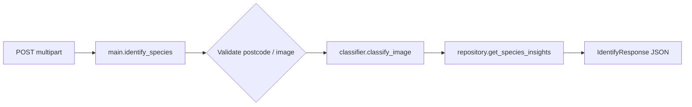

# EPIC 3 Code Walkthrough: From the Start

This document explains the **EPIC 3 “species image identification + local insights” code** in the FIT5120 repository: from process startup and HTTP handling, through optional offline training and how artifacts connect to the API. It focuses on **architecture and reading order**, not a line-by-line dump of source.

---

## 1. Problem This Code Solves

- **Input**: User uploads an image plus an Australian four-digit **postcode**.
- **Output**: One or more **species predictions** (scientific name, common name, confidence) and, when the database is reachable, **read-only PostgreSQL** context such as local/Victorian sightings and conservation status.
- **Design constraints**: Database is **read-only**; the vision backend is **pluggable**; the service should still start when GPU is absent or ML dependencies are missing (via fallbacks).

---

## 2. Directory Map

| Path | Role |
|------|------|
| `epic3_api/main.py` | FastAPI app: `/health`, `/api/epic3/identify`. |
| `epic3_api/config.py` | Loads `Settings` from env (DB, upload limits, model paths, CORS, classifier backend). |
| `epic3_api/schemas.py` | Pydantic models: `Prediction`, `SpeciesInsight`, `IdentifyResponse`, etc. |
| `epic3_api/classifier.py` | `build_classifier`: chooses and falls back among **demo / ImageNet / fine-tuned species** backends. |
| `epic3_api/db.py` | `ReadOnlySpeciesRepository`: postcode → suburb; predictions → aggregated `species_cache` stats. |
| `epic3_api/ml/preprocess.py` | Decodes upload bytes to RGB with PIL. |
| `epic3_api/ml/imagenet_classifier.py` | ImageNet-pretrained EfficientNet-B0, 1000 generic classes. |
| `epic3_api/ml/species_classifier.py` | Loads local `species_classifier.pt` + `labels.json` for multi-class Australian species. |
| `epic3_training/` | Download, train, and evaluate scripts (not started by the API process). |
| `data/epic3/` | Training images and metadata (default write location). |
| `models/epic3/` | Exported `species_classifier.pt` and `labels.json`. |

For **HTTP contract and frontend examples**, see `epic3_api/FRONTEND_USAGE.md`. For install and run commands, see `epic3_api/README.md`.

---

## 3. What Happens at Startup (Top Down)

1. **`uvicorn epic3_api.main:app`** imports `epic3_api/main.py`.
2. **`load_settings()`** (`config.py`) reads `PGHOST`, `EPIC3_CLASSIFIER_BACKEND`, `EPIC3_MODEL_PATH`, etc., and builds an immutable `Settings`.
3. **`build_classifier(...)`** (`classifier.py`) inspects `EPIC3_CLASSIFIER_BACKEND` and whether model files exist on disk, constructs a `SpeciesClassifier`, and stores it on `app.state.classifier`.
4. **`ReadOnlySpeciesRepository`** (`db.py`) holds the DSN; connections use `readonly=True` and only run `SELECT`.
5. **CORS** middleware is registered from `settings.cors_origins` so browsers can call the API cross-origin.

After that, **every request reuses the same** classifier and repository instances (the model is loaded once).

---

## 4. Code Path for `POST /api/epic3/identify`

1. **`identify_species`** (`main.py`)  
   - Validates postcode regex, `Content-Type`, non-empty body, and size under `max_upload_bytes`.  
   - `await image.read()` → raw bytes.

2. **`classifier.classify_image(image_bytes, top_k)`**  
   Implementation depends on the active backend (next section); returns `list[Prediction]`.

3. **`repository.get_species_insights(postcode, predictions)`**  
   - For each prediction, runs `SPECIES_CONTEXT_SQL` (`db.py`) joining `species_cache` with `suburb_demographics` for counts and timestamps.  
   - On DB failure, `main.py` catches the exception, appends a message to `warnings`, and still returns `SpeciesInsight` rows with prediction fields only.

4. Builds **`IdentifyResponse`** JSON.

---

## 5. `build_classifier`: Three Backends and Auto Fallback

All selection logic lives in **`build_classifier`** in `epic3_api/classifier.py`.

| `EPIC3_CLASSIFIER_BACKEND` | Behaviour |
|----------------------------|-----------|
| `demo` | `DemoSpeciesClassifier`: SHA256 over bytes, **deterministic** rotation over a label list with synthetic confidences; **no** PyTorch. |
| `imagenet` | `ImageNetClassifier`: EfficientNet-B0 with ImageNet weights; labels are ImageNet English class names. |
| `species` / `species_finetuned` | **Force** `FineTunedSpeciesClassifier`; raises if files are missing or load fails. |
| `auto` (default) | If `species_classifier.pt` and `labels.json` exist and load → **fine-tuned model**; else try **ImageNet**; else **demo**. |

This lets CI and laptops without `torch` run tests (`demo`), while production picks up a real checkpoint when files are present.

---

## 6. Fine-Tuned Classifier: `FineTunedSpeciesClassifier`

File: `epic3_api/ml/species_classifier.py`.

Key points:

1. **Lazy `import torch`** so other backends can run without PyTorch installed.
2. **Architecture**: `efficientnet_b0(weights=None)` matching training; replace `classifier[1]` with `Linear(in_features, num_classes)` where `num_classes = len(labels.json)`.
3. **Checkpoint**: `torch.load` accepts either a dict with `model_state_dict` or a bare `state_dict`.
4. **Inference**: `open_rgb_image` → `EfficientNet_B0_Weights.DEFAULT.transforms()` (same normalization as training) → `softmax` → `topk` → map indices to `SpeciesLabel`.

**Order of entries in `labels.json`** must match the `ImageFolder` class order from training; the training script writes this file via **`export_labels`** from `dataset.classes` at the end of a run.

---

## 7. Database Layer: Read-Only Insights

File: `epic3_api/db.py`.

- **`SUBURB_SQL`**: Resolve postcode to suburb / LGA names from `suburb_demographics`.  
- **`SPECIES_CONTEXT_SQL`**: Match `species_cache` rows by scientific or vernacular name, then aggregate **sighting counts, conservation status, cache timestamps**, scoped by postcode and LGA.

The API **never** runs INSERT/UPDATE/DELETE; writers belong in separate ETL or jobs.

---

## 8. Offline Training Pipeline: From Species List to `species_classifier.pt`

Training is **decoupled** from the online API: separate CLI processes.

### 8.1 Species list

- `epic3_training/species_targets.json`: each row has `scientific_name`, `common_name`, and `taxon_name` (used for iNaturalist queries).

### 8.2 Download images

- Script: `epic3_training/download_inaturalist_subset.py`  
- Reads that JSON (optional `--max-species` takes the first *N* entries), queries iNaturalist by `taxon_name`, filters **research grade + allowed licenses**, writes images under `data/epic3/images/<slugified_scientific_name>/`.  
- Caps volume with **`--images-per-species`**, **`--max-total-mb`**, etc., so downloads do not fill the disk.

### 8.3 Train

- Script: `epic3_training/train_species_classifier.py`  
- `torchvision.datasets.ImageFolder`: subdirectory name = class id (slug).  
- **Split**: stratified `train_test_split` → train/val indices.  
- **Imbalance**: `class_weights_for_targets` + `WeightedRandomSampler`; optional `--target-class` / `--target-boost` for priority species.  
- **Phased fine-tuning**: train classifier head only for `--head-epochs`, then unfreeze the last `--unfreeze-blocks` EfficientNet blocks with a smaller `--fine-tune-learning-rate`.  
- **Export**: saves `species_classifier.pt` when validation accuracy improves; **`export_labels`** writes `models/epic3/labels.json` at the end.

### 8.4 Evaluate

- Script: `epic3_training/evaluate_species_classifier.py`  
- Computes global top-1 / top-3 and **per-class** metrics over the full `ImageFolder` to spot weak classes.

After training, place artifacts under the path the API reads (or set `EPIC3_MODEL_PATH` / `EPIC3_LABELS_PATH`) and **restart** the API so `auto` picks up the new weights.

---

## 9. How Tests Fit In

`tests/test_epic3_api.py` sets **`EPIC3_CLASSIFIER_BACKEND=demo`** (and similar) so CI and environments without large models still exercise routes and validation.

---

## 10. Suggested First Read Order

1. `epic3_api/schemas.py` — understand the public JSON shape.  
2. `epic3_api/main.py` — validation and call order.  
3. `epic3_api/classifier.py` — backend selection and fallback.  
4. `epic3_api/ml/species_classifier.py` + `imagenet_classifier.py` — inference details.  
5. `epic3_api/db.py` — SQL and `SpeciesInsight` fields.  
6. `epic3_training/train_species_classifier.py` — model structure and export contract aligned with production.

If you only care how a web page calls the API, start from `FRONTEND_USAGE.md` and return here when you need the server-side story.
